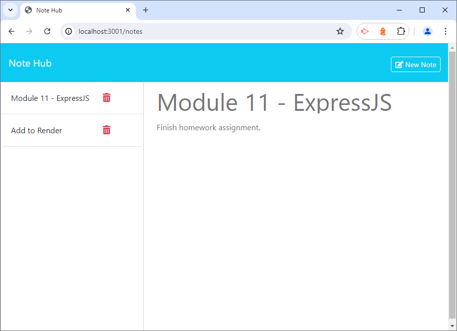

# Note Hub

## Description
Note Hub is an application that allows a user to manage all of their Notes.  As new Notes are needed, they can be easily added to Note Hub to keep track of them.  If the user needs to delete a Note for any reason, Note Hub allows for that as well.
 

 
Click <a href="https://github.com/BradBurr-Github" target="_blank">here</a> to run Git Hub
## Table of Contents
1. [Installation](#installation)
2. [Usage](#usage)
3. [License](#license)
4. [Contributing](#contributing)
5. [Tests](#tests)
6. [Questions](#questions)
7. [Acknowledgements](#acknowledgements)

## Installation
npm install

## Usage
This application is public and the code can easily be cloned to be used by anyone.

## License
This project is not currently licensed.

## Contributing
Please email me with any comments and suggestions about Note Hub.

## Tests
npm run test

## Questions
If you have any questions about this Project or its Repository, I can be reached at <a href=mailto:brabur@yahoo.com>brabur@yahoo.com</a>.  You can also find more of my work at <a href="https://github.com/BradBurr-Github" target="_blank">BradBurr-Github</a>.

## Acknowledgements
None at this time.